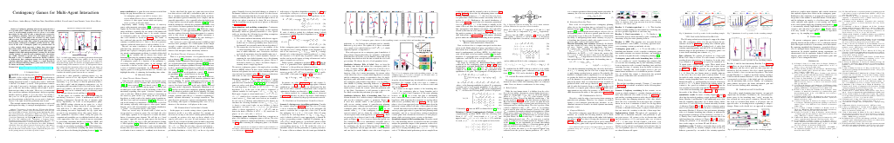

## Contingency Games for Multi-Agent Interaction (RA-L 2024)

[](https://github.com/lassepe/peters2024ral-code/actions/workflows/ci.yml)
[](https://codecov.io/gh/lassepe/peters2024ral-code)
[](https://opensource.org/licenses/MIT)
[](https://arxiv.org/abs/2304.05483)
[](https://lasse-peters.net/pub/contingency-games)


[](https://ieeexplore.ieee.org/stamp/stamp.jsp?arnumber=10400882)

Code for the [RA-L 2024 paper "Contingency Games for Multi-Agent Interactions."]( https://ieeexplore.ieee.org/stamp/stamp.jsp?arnumber=10400882) [[arXiv](https://arxiv.org/abs/2304.05483)] [[project website](https://lasse-peters.net/pub/contingency-games) for more information.]

---

### Quickstart Guide

**Initial setup**

1. Install Julia 1.10 or higher.

2. Export the environment variable `PATH_LICENSE_STRING` with a value set to a valid license string; for example, the ["courtesy license"](https://pages.cs.wisc.edu/~ferris/path/LICENSE) from Michael Ferris' website which we need to run larger problems.

3. Start Julia in the repository root as `julia --project` to activate the environment. Hit `]` to enter package mode and run `instantiate` to instantiate all the dependencies recorded for this environment.

**Running Interactive Examples**

From a Julia REPL started at the repository root as `julia --project` run the following code:

```julia
begin
using ContingencyGames
demo_setup = ContingencyGames.Examples.setup_crosswalk_demo()
ContingencyGames.Examples.demo(demo_setup)
end
```

This should spin up a GUI of a receding-horizon simulation in which you can also interactive set the parameters of the planner and the simulation environment.

You can find more examples in the `ContingencyGames.Examples` module.

---

### Large Scale Monte Carlo Simulation and Plots for the RA-L 2024 Paper

The code to reproduce the large scale Monte Carlo simulations and plots from the RA-L 2024 paper is available in [`MonteCarloStudy.jl`](/MonteCarloStudy.jl).

All simulations follow a similar pattern with separate functions for problem generation, running the study, and plotting the results. For example, to generate the plots for the 3-player receding-horizon overtaking study:

1. Create the environment and solver:
    ```julia
    demo_setup = MonteCarloStudy.setup_receding_horizon_overtaking_demo()
    ```
2. Run the study:
    ```julia
    benchmark = MonteCarloStudy.receding_horizon_overtaking_benchmark(demo_setup)
    ```
3. Generate figures (saved as PDF in `./results/figures`)
    ```julia
    MonteCarloStudy.generate_all_overtaking_receding_horizon_figures(benchmark)
    ```

---

### Citing this work


```bibtex
@article{peters2024ral,
  title={Contingency Games for Multi-Agent Interaction},
  author={Peters, Lasse and Bajcsy, Andrea and Chiu, Chih-Yuan and Fridovich-Keil, David and Laine, Forrest and Ferranti, Laura and Alonso-Mora, Javier},
  journal={IEEE Robotics and Automation Letters (RA-L)},
  year={2024},
}
```
